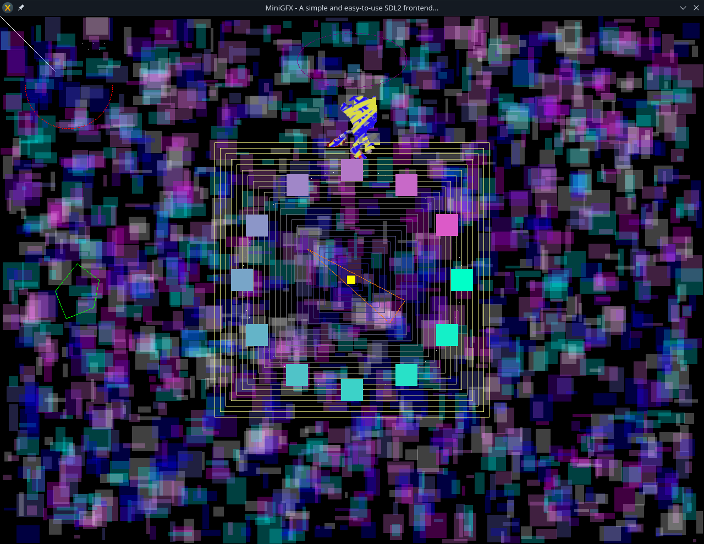

# MiniGFX
A lightweight C++ graphics library based on SDL2, created for educational and training purposes.

## ⚙️ Installation

1. Install SDL2 and SDL2_image on your system
2. Include the header file `MiniGfx.h` in your project
3. Call `SDLWindow::demo();` inside `main()` to see a working example

## 💻 Example

```cpp
#include "MiniGfx.h"

int main(int argc,char** argv){
	SDLWindow::demo();
	return 0;
}
```

## 📸 Screenshot



---

Author: Gonçalo Ferreira  
Date: July 2025  
Website: [goncalo.pt](https://www.goncalo.pt)
